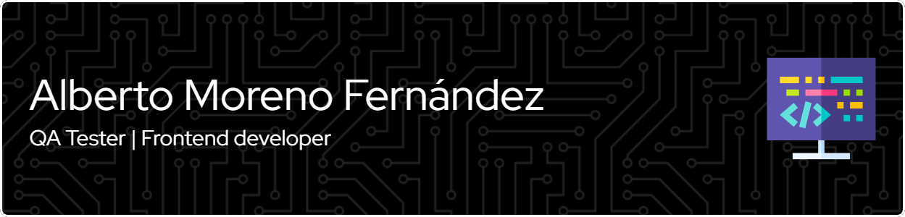

Hello, my name is Alberto and I have just finished my studies in Web Applications Design.

Maybe I got into the world of programming too late, but computers and web design have always attracted my attention.
At the moment my collection of repositories is small, it is based mainly on exercises proposed in the two years that lasted my studies, but I hope to gradually increase it over time.

If you want to know more about my professional career you can find me on my linkedin profile [https://www.linkedin.com/in/alberto-moreno-fernández/](https://www.linkedin.com/in/alberto-moreno-fernández/)

If you want to contact me you can do by email alberto111978@gmail.com

## Languages and tools that I have been using for the last two years
Although I'm sure I've forgotten some of them

## A few statistics

